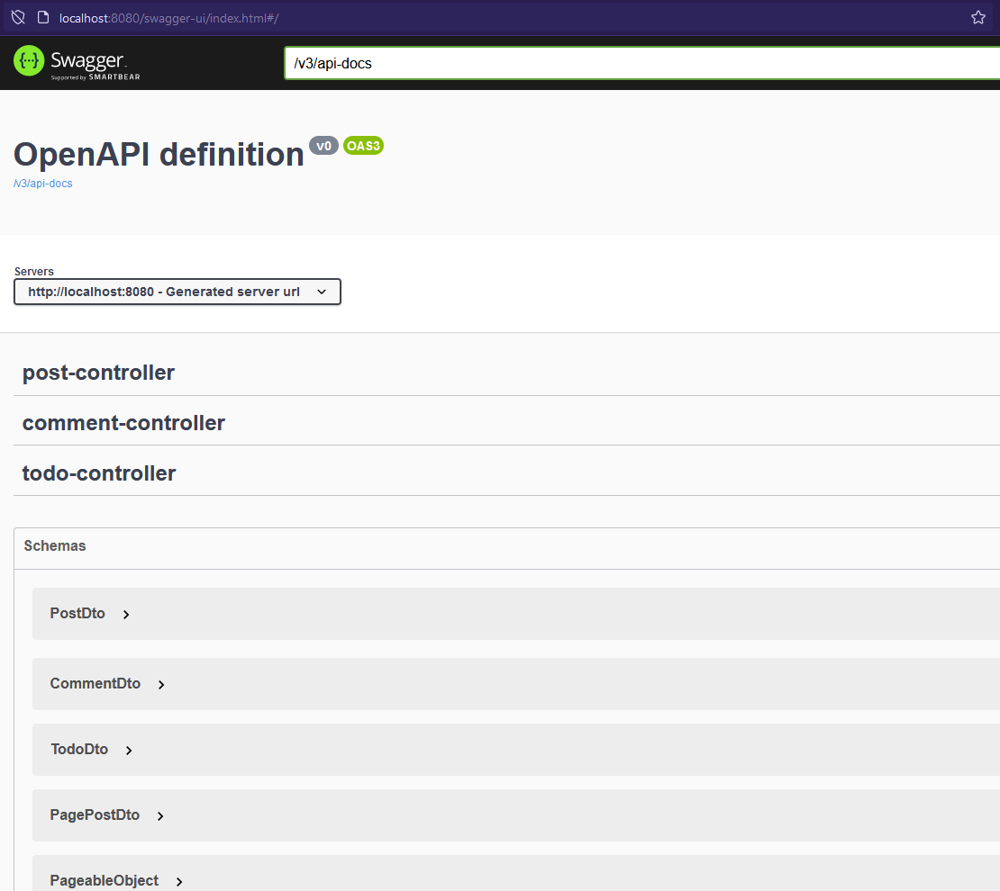
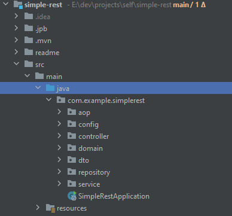

# simple-spring-web

This is a simple app to show code Assessment.
Show some topics like:

* Clean code
* Multi-tier architecture(such as MVC)
* Unit and integration testing
* Logging
* Exception handling
* Documentation
  *, etc...

The database of use in this project does not have **Data Migration** like flyway to simplify of project.

App has swagger Api _(use spring-doc)_ to generate API Doc for this project.

This project uses an MVC design pattern.

Some library and technology used in this project:
* Java 17
* Spring Web
* Spring Data
* Spring Batch
* Spring AOP
* H2 Database
* Hibernate ORM
* JUnit
* Lombok
* ...
